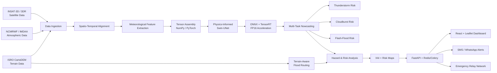

# Meghdoot-AI
# 🌧️ MEGHDOOT AI

### Physics-Informed Hyper-Local Early Warning Engine for Cloudbursts & Flash Floods

> **Smart India Hackathon 2026 — SIH26077**  
> **Theme:** Disaster Management  
> **Team:** Cyber&Squad  
> **Team ID:** 157700

---

## 📌 Overview

**MEGHDOOT AI** is a proposed physics-informed, hyper-local nowcasting and early-warning system designed to detect and assess the risk of **severe thunderstorms, cloudbursts, and flash floods**.

The system combines:

- 🛰️ INSAT-3D / INSAT-3DR satellite observations
- 🌦️ NCMRWF / IMDAA atmospheric reanalysis
- 🗺️ ISRO CartoDEM terrain data
- 🧠 Physics-informed deep learning
- 🌊 Terrain-aware hydrological routing
- 🗺️ GIS-based risk visualization
- 🔍 Explainable AI (XAI)
- 📱 Multi-channel emergency alerts

The intended outcome is a location-specific warning pipeline capable of supporting an **actionable 2–6 hour warning window** for vulnerable regions.

---

# 🎯 Problem

Conventional weather forecasting systems can be computationally expensive and spatially coarse for rapidly developing, highly localized events such as:

**Severe Thunderstorm → Cloudburst → Flash Flood**

MEGHDOOT AI aims to bridge this gap by combining high-frequency satellite observations, atmospheric variables, terrain information, and AI-based nowcasting into a single pipeline.

---

# 🏗️ Proposed System Architecture



---

# 🔬 Technical Approach

The proposed implementation is divided into the following stages:

### 1. Data Ingestion

The system uses multiple complementary data sources.

**Satellite:**
- INSAT-3D / INSAT-3DR
- Thermal Infrared (TIR)
- Water Vapour (WV)
- Cloud-top temperature
- Cloud motion
- Rainfall / QPE

**Atmospheric:**
- NCMRWF / IMDAA
- IWV
- CAPE / CIN
- Temperature & humidity
- Low-level wind convergence
- Vertical wind shear

**Terrain:**
- ISRO CartoDEM 30 m
- Elevation
- Slope
- Drainage network
- Terrain / land-cover information

---

### 2. Spatio-Temporal Alignment

Satellite, atmospheric and terrain datasets have different spatial resolutions, coordinate systems and temporal characteristics.

The preprocessing layer is designed to align these sources into a common model-ready representation.

Planned technologies include:

- `Satpy`
- `rioxarray`
- `PostGIS`
- `NumPy`
- `PyTorch`

---

### 3. Meteorological Feature Extraction

Important meteorological indicators include:

- **IWV** — Integrated Water Vapour
- **CAPE / CIN** — atmospheric instability indicators
- **Cloud-top temperature cooling**
- **Wind convergence**
- **Vertical wind shear**

These features are intended to provide the AI model with both atmospheric and spatial context.

---

### 4. AI / Deep Learning

The proposed core model is a:

> **Physics-Informed Swin-UNet Transformer architecture**

The model is designed for spatio-temporal weather prediction while incorporating physics-related constraints involving:

- Moisture conversion
- Atmospheric dynamics
- Terrain influence

The proposed input tensor representation is:

```text
(1, 5, 4, 256, 256)
```

---

### 5. Multi-Task Nowcasting

The model is designed to provide multiple hazard outputs:

```text
             ┌── Severe Thunderstorm Risk
AI Model ────┼── Cloudburst Risk
             └── Flash-Flood Risk
```

The system also considers:

- Hazard onset
- Hazard intensity
- Location-specific risk

---

### 6. Inference Acceleration

The proposed inference optimization stack consists of:

- ONNX
- NVIDIA TensorRT
- FP16 inference
- Swin-UNet ONNX model

The current architecture specifies **<300 ms as a target inference execution time**.

> ⚠️ This is currently a **design target, not a measured end-to-end benchmark**.

---

### 7. Terrain-Aware Flood Routing

Meteorological predictions are combined with terrain characteristics to estimate potential flood impact.

Proposed components:

- PySheds
- CartoDEM
- Slope
- Drainage network
- CartoDEM DAG routing

This stage connects:

```text
Weather Prediction
       ↓
Rainfall / Hazard
       ↓
Terrain + Drainage
       ↓
Flood Risk
```

---

### 8. Hazard & Risk Analysis

The system combines meteorological, hydrological and geographic information to generate location-specific risk.

Inputs include:

- Rainfall intensity and accumulation
- Runoff / inundation potential
- Terrain susceptibility
- Drainage characteristics
- Population / settlement exposure
- Location-specific hazard level

---

### 9. Explainable AI

The proposed system includes an XAI layer to make model outputs more interpretable.

Planned visualization includes:

- Risk maps
- Grad-CAM overlays
- Live vector flood maps
- Hydrographs
- Hazard explanations

---

### 10. Backend & API Layer

The proposed backend architecture uses:

| Component | Technology |
|---|---|
| API | FastAPI |
| Server | Uvicorn |
| Async Tasks | Celery |
| Task Queue | Redis |
| Database | PostgreSQL |
| Spatial Database | PostGIS |

The API layer is intended to connect model inference, risk analysis, dashboard visualization and alert services.

---

### 11. Dashboard

The proposed frontend stack is:

- React.js
- Tailwind CSS
- Leaflet.js

The dashboard is intended to provide:

- Hyper-local risk maps
- Live flood visualization
- Model explanation overlays
- Hydrographs
- Location-specific warnings

---

### 12. Alert & Emergency Communication

The proposed warning layer includes:

- Web dashboard
- SMS
- WhatsApp API
- Location-specific 2–6 hour warnings

An additional emergency communication concept uses:

- Google Nearby Connections API
- Bluetooth Low Energy
- Wi-Fi Direct
- Compressed binary SOS messages

This is intended as a proposed offline communication mechanism for situations where conventional connectivity is unavailable.

---

# 🧰 Technology Stack

| Layer | Technologies |
|---|---|
| Satellite Data | INSAT-3D / INSAT-3DR, ISRO MOSDAC |
| Atmospheric Data | NCMRWF / IMDAA |
| Terrain Data | ISRO CartoDEM |
| Data Processing | Satpy, rioxarray |
| Numerical Processing | NumPy |
| Deep Learning | PyTorch |
| AI Architecture | Swin-UNet Transformer |
| Model Optimization | ONNX, TensorRT, FP16 |
| Hydrology | PySheds |
| Database | PostgreSQL + PostGIS |
| Backend | FastAPI + Uvicorn |
| Async Processing | Celery + Redis |
| Frontend | React.js + Tailwind CSS |
| GIS | Leaflet.js |
| Explainability | Grad-CAM / XAI |
| Alerts | SMS / WhatsApp API |
| Emergency Relay | Nearby Connections, BLE, Wi-Fi Direct |
| Deployment | Render / Vercel |

---

# 🚧 Current Development Status

## 🟡 Prototype Status: ~20–30% Completed

The project is currently in the **prototype/development stage**.

Approximately **20–30% of the overall proposed implementation has been initiated**. The complete system is **not yet fully operational**.

### ✅ Currently Defined / Initiated

- [x] Overall system architecture
- [x] Multi-source data pipeline design
- [x] Satellite + atmospheric + terrain data strategy
- [x] Spatio-temporal processing architecture
- [x] Meteorological feature definition
- [x] Physics-informed AI architecture
- [x] Swin-UNet model approach
- [x] Tensor-based model input design
- [x] ONNX / TensorRT acceleration strategy
- [x] Terrain-aware flood-routing architecture
- [x] GIS dashboard architecture
- [x] Backend/API architecture
- [x] Alert-dispatch architecture

### 🔄 In Progress / To Be Integrated

- [ ] Complete real-time data ingestion
- [ ] Full preprocessing pipeline
- [ ] End-to-end model training
- [ ] Physics-constraint implementation and validation
- [ ] Multi-task hazard prediction
- [ ] Hydrological routing integration
- [ ] Complete risk-scoring pipeline
- [ ] XAI / Grad-CAM integration
- [ ] FastAPI + asynchronous pipeline integration
- [ ] Live GIS dashboard
- [ ] SMS / WhatsApp alert integration
- [ ] Offline emergency relay integration
- [ ] End-to-end testing and validation

---

# 🗺️ Development Roadmap

```text
Phase 1
Data Ingestion
      ↓
Phase 2
Preprocessing & Alignment
      ↓
Phase 3
Feature Engineering
      ↓
Phase 4
AI Model Training
      ↓
Phase 5
Physics Constraints
      ↓
Phase 6
Multi-Hazard Prediction
      ↓
Phase 7
Terrain-Aware Hydrology
      ↓
Phase 8
Risk + XAI
      ↓
Phase 9
API + Dashboard
      ↓
Phase 10
Alert System
      ↓
Phase 11
End-to-End Validation
      ↓
Production-Ready Prototype
```

---

# 📊 Important Performance Note

The project currently contains several **proposed targets and architectural goals** rather than experimentally validated final results.

In particular:

- **2–6 hour warning window** → intended system objective
- **<300 ms inference** → proposed optimization target
- Hyper-local risk accuracy → requires event-based validation
- False-alarm reduction → requires model evaluation
- End-to-end alert latency → requires deployment testing

These values should not be interpreted as measured production performance until the complete prototype has been implemented and evaluated.

---

# 🌍 Intended Impact

MEGHDOOT AI is intended to support:

### 🧑‍🤝‍🧑 Community Safety
Provide earlier warnings for vulnerable communities in severe-weather-prone regions.

### 🚨 Disaster Response
Help authorities identify areas requiring attention and preparedness.

### 🌊 Flood Management
Combine rainfall/hazard predictions with terrain and drainage information.

### 🏗️ Infrastructure Protection
Support earlier preparedness for critical infrastructure and services.

### 🌱 Environmental Protection
Support proactive watershed and flood-risk management.

---

# 📚 Research Basis

The project architecture is informed by research and resources covering:

- Physics-informed neural networks for precipitation nowcasting
- Swin Transformers for meteorological nowcasting
- Geostationary satellite meteorological products
- High-resolution regional atmospheric reanalysis for India
- Explainable deep learning for spatial meteorological models
- Satellite-based high-resolution precipitation nowcasting

The detailed technical references are maintained in the project presentation and technical approach report.

---

# 📄 Technical Documentation

For the detailed implementation methodology, architecture explanation and module-level technical description:

**[Read the Technical Approach Report](./docs/TECHNICAL_APPROACH.md)**

---

# 👥 Team

**Cyber&Squad**  
**Smart India Hackathon 2026**  
**Team ID:** 157700

---

## ⚠️ Development Disclaimer

MEGHDOOT AI is currently a **prototype under development**. The architecture, technology stack and workflow described in this repository represent the proposed implementation and components currently being developed.

Approximately **20–30% of the overall proposed system has been initiated at this stage**, and the complete system is not yet operational.

Performance values and impact estimates should therefore be treated as **design objectives until validated through real-world or historical-event testing**.

---

> **From weather signals to actionable alerts.**  
> *MEGHDOOT AI — Physics-Informed Hyper-Local Nowcasting for Severe Weather.*
