# MEGHDOOT AI — Technical Approach & Implementation Report

**Smart India Hackathon 2026**  
**Problem Statement:** SIH26077 — *MEGHDOOT AI = Physics-Informed Hyper-Local Nowcasting for Severe Weather*  
**Team:** Cyber&Squad  
**Team ID:** 157700  
**Theme:** Disaster Management  

---

## 1. Technical Approach Overview

**MEGHDOOT AI** is designed as a physics-informed, hyper-local severe-weather nowcasting and early-warning system for **cloudbursts, severe thunderstorms, and flash floods**. The central technical idea is to combine multiple weather and terrain data sources, align them in space and time, extract meteorological indicators, perform AI-based multi-hazard nowcasting, incorporate terrain-aware flood routing, and finally convert the resulting risk into location-specific alerts.

The proposed architecture is deliberately divided into independent stages so that satellite observations, atmospheric reanalysis, terrain information, AI inference, hydrological analysis, visualization, and alert delivery can be developed and updated independently.

The complete pipeline is:

> **Data Sources → Data Processing → Tensor Assembly → Physics-Informed AI Inference → Acceleration → Hydrological Analysis → Risk Mapping → API Services → Dashboard & Emergency Alerts**

The system uses three primary data categories:

1. **Satellite observations** from ISRO MOSDAC / INSAT-3D and INSAT-3DR.
2. **Atmospheric information** from NCMRWF/IMDAA reanalysis.
3. **Terrain information** from ISRO CartoDEM.

The technical approach shown in the team's Technical Approach slide is expanded below into the actual data flow and responsibilities of each module. The presentation identifies the current prototype as approximately **25–30% initiated and not yet completely operational**, so the architecture below should be understood as the proposed implementation pipeline rather than a claim that every component is already production-ready.

---

## 2. System Architecture

```mermaid
flowchart LR
    A[ISRO MOSDAC<br/>INSAT-3D / 3DR<br/>TIR + Water Vapour]
    B[NCMRWF / IMDAA<br/>Atmospheric Reanalysis<br/>Wind + Weather Variables]
    C[ISRO CartoDEM 30m<br/>Elevation + Terrain]

    A --> D[Data Ingestion]
    B --> D
    C --> D

    D[Satpy + Rioxarray<br/>Ingestion & Raster Processing]
    --> E[Spatio-Temporal Alignment<br/>Satellite + Atmosphere + Terrain]

    E --> F[Dynamic Masking & QC<br/>PostGIS / Spatial Processing]
    --> G[Meteorological Feature Extraction<br/>IWV, CAPE/CIN,<br/>CTT Cooling, Convergence/Shear]

    G --> H[Tensor Assembly<br/>NumPy / PyTorch<br/>4D Tensor: 1×5×4×256×256]

    H --> I[Physics-Informed<br/>Swin-UNet Model]
    I --> J[ONNX / TensorRT FP16<br/>Inference Acceleration]

    J --> K[Multi-Task Nowcasting<br/>Thunderstorm + Cloudburst<br/>+ Flash Flood]

    C --> L[Terrain-Aware Flood Routing<br/>PySheds + CartoDEM DAG Router]
    K --> M[Hazard & Risk Analysis]
    L --> M

    M --> N[Risk Map + Explanation<br/>Grad-CAM / XAI]
    N --> O[FastAPI + Uvicorn<br/>Redis Async Workers]

    O --> P[React + Leaflet GIS Dashboard]
    O --> Q[SMS / WhatsApp Alerts]
    O --> R[Offline P2P Emergency Relay<br/>Nearby Connections + BLE/Wi-Fi Direct]
```



### Diagram Explanation

The architecture begins with three complementary sources. Satellite observations provide information about cloud and atmospheric conditions, atmospheric reanalysis provides meteorological variables, and CartoDEM supplies the physical terrain context required for flood susceptibility and routing.

These datasets are then transformed into a common spatio-temporal representation. The resulting features are assembled into tensors and passed to the AI inference layer. The AI layer performs multi-task prediction for severe thunderstorms, cloudbursts, and flash floods. In parallel, terrain data are processed through hydrological routing so that predicted rainfall/hazard information can be related to drainage and terrain characteristics.

The outputs are combined into a risk-analysis layer. The resulting risk information is exposed through API services and visualized on a GIS dashboard. The same risk output can be converted into location-specific warning messages through SMS/WhatsApp channels and, in the proposed emergency architecture, an offline peer-to-peer relay mechanism.

---

# 3. Detailed Implementation Methodology

## 3.1 Data Ingestion

The first stage collects the raw inputs required for nowcasting.

### Satellite Data — INSAT-3D / INSAT-3DR

The presentation identifies the following satellite-derived variables:

- Thermal Infrared (TIR)
- Water Vapour (WV)
- Cloud-top temperature
- Cloud motion
- Rainfall / QPE

These observations provide the system with continuously updated information about cloud development and atmospheric moisture.

The proposed ingestion layer uses **Satpy** and **rioxarray** to read and process satellite/raster products.

### Atmospheric Data — NCMRWF / IMDAA

Atmospheric information is used to provide meteorological context around the satellite observations. The identified variables include:

- Integrated Water Vapour (IWV)
- CAPE / CIN
- Temperature and humidity
- Low-level wind convergence
- Vertical wind shear

These variables help describe atmospheric instability, moisture availability and dynamic conditions associated with severe weather formation.

### Terrain Data — CartoDEM

The system also incorporates **ISRO CartoDEM 30 m** terrain data. The presentation identifies:

- Elevation
- Slope
- Drainage network
- Land cover / terrain characteristics

Terrain information is important because the same rainfall event can produce very different flood impacts depending on elevation, slope and drainage structure.

---

## 3.2 Spatio-Temporal Alignment and Preprocessing

The three data sources do not naturally arrive in identical spatial grids, coordinate systems or time intervals. Therefore, the second stage aligns:

> **Satellite + Atmospheric + Terrain Data**

The preprocessing layer performs data ingestion, spatial transformation, dynamic masking and quality control before the information enters the AI pipeline.

The proposed stack includes:

- **Satpy** for satellite data handling
- **rioxarray** for raster/geospatial processing
- **PostGIS** for spatial/vector operations
- **NumPy / PyTorch** for numerical and tensor processing

The objective is to transform heterogeneous observations into a consistent model-ready representation.

---

## 3.3 Meteorological Feature Extraction

After alignment, the system derives the meteorological features highlighted in the presentation:

### Integrated Water Vapour — IWV
Represents the amount of atmospheric water vapour available in the atmospheric column. It provides a moisture-related signal for severe precipitation development.

### CAPE / CIN
These variables represent atmospheric instability and inhibition. They provide information about the potential for strong convective activity.

### Cloud-Top Temperature Cooling
Rapid cloud-top cooling can indicate strong convective development. This feature is derived from satellite observations and contributes to the severe-weather signal.

### Wind Convergence / Vertical Shear
Wind convergence and vertical wind shear provide information about atmospheric dynamics that can influence thunderstorm development and organization.

These features are combined with the spatial satellite representation rather than relying on a single weather variable.

---

# 4. AI / Deep Learning Inference Layer

## 4.1 Tensor Assembly

The presentation specifies a model input representation of:

```text
4D Tensor:
(1, 5, 4, 256, 256)
```

The tensor assembly stack uses **NumPy / PyTorch** to organize the processed inputs into a consistent structure for model inference.

This stage is important because the model must receive information in a fixed spatial and feature representation rather than independent raw datasets.

---

## 4.2 Physics-Informed Swin-UNet

The core AI component identified by the team is a:

> **Swin-UNet Transformer-based physics-informed architecture**

The model is intended to combine spatial feature extraction with temporal/spatial weather patterns while incorporating physics-related constraints into the prediction process.

The objective is not simply to generate a weather prediction from historical patterns. The architecture is designed so that the prediction process also considers physical relationships represented by:

- Moisture conversion
- Atmospheric dynamics
- Terrain influence

This physics-informed component is intended to reduce physically implausible predictions and help control false alarms, as described in the feasibility section of the presentation.

---

## 4.3 Multi-Task Nowcasting

Instead of creating completely independent systems for each hazard, the architecture defines a multi-task nowcasting stage with three related outputs:

```text
                    ┌── Severe Thunderstorm Risk
AI Nowcasting ──────┼── Cloudburst Risk
                    └── Flash-Flood Risk
```

The system therefore attempts to model the progression:

**Severe Thunderstorm → Cloudburst → Flash-Flood Risk**

while producing hazard-specific information.

The presentation also identifies **onset and intensity** as part of the hazard-analysis output.

---

# 5. Inference Acceleration

For operational use, model inference needs to be substantially faster than conventional large-scale numerical weather prediction workflows.

The proposed acceleration stack is:

- **ONNX**
- **NVIDIA TensorRT**
- **FP16 inference**
- **Swin-UNet ONNX model**

The presentation specifies a target execution time of **<300 ms** for the inference component.

This should currently be treated as an **architecture/performance target**, not as a validated benchmark: the presentation explicitly states that the prototype is only around 25–30% initiated and is not yet completely operational.

The purpose of the acceleration layer is to make frequent model inference practical on available compute resources and support the intended rapid-warning workflow.

---

# 6. Terrain-Aware Flood Routing

Meteorological prediction alone does not fully describe the impact of a flash flood. The same precipitation intensity can produce different levels of flooding depending on terrain and drainage.

The system therefore includes a separate hydrological-analysis layer using:

- **PySheds**
- **CartoDEM**
- Slope information
- Drainage information
- Terrain-aware routing

The proposed **CartoDEM DAG Router** and PySheds engine are used to derive how water can move through the terrain.

This creates a bridge between:

> **Meteorological Hazard → Physical Terrain → Flood Risk**

The result can be represented through live flood maps and hydrographs on the GIS interface.

---

# 7. Hazard & Risk Analysis

The meteorological and hydrological outputs are combined to generate a location-specific risk representation.

The presentation identifies the following risk-analysis inputs:

- Rainfall intensity and accumulation
- Runoff / inundation potential
- Terrain and drainage susceptibility
- Population / settlement exposure
- Location-specific risk level

This transforms a raw prediction into an actionable geographic risk layer.

For example, two locations receiving similar rainfall may receive different risk levels if one has substantially greater terrain or drainage susceptibility.

---

# 8. Explainable AI and Risk Visualization

The system includes an **XAI layer** so that the warning is not presented only as an unexplained model output.

The dashboard architecture specifies:

- **Grad-CAM overlay**
- Live vector flood maps
- Stream hydrographs
- Risk maps
- Risk explanation

The objective is to provide a visual explanation of the regions or features contributing to the model's prediction, allowing users such as authorities to interpret the warning alongside the geographic hazard information.

---

# 9. Runtime, APIs and Dashboard

## Backend

The proposed backend stack is:

- **FastAPI**
- **Uvicorn**
- **Redis task queue**
- **Celery**
- **PostgreSQL + PostGIS**

FastAPI exposes the prediction and risk-analysis services through APIs. Uvicorn provides the application server, while asynchronous workers and Redis/Celery are intended to handle processing tasks without blocking the primary API layer.

PostgreSQL with PostGIS provides the spatial database foundation for geographic and vector-based operations.

## Frontend

The proposed dashboard uses:

- **React.js**
- **Tailwind CSS**
- **Leaflet.js**

Leaflet provides the GIS mapping layer, while React manages the interactive dashboard and Tailwind CSS handles the interface styling.

The dashboard is intended to show:

- Hyper-local risk maps
- Live flood vectors
- Model explanation overlays
- Hydrographs
- Location-specific hazard information

---

# 10. Alert and Emergency Communication Layer

The final stage converts risk information into an actionable warning.

The presentation specifies:

### Web / Mobile Alerts
Warnings can be displayed through the GIS dashboard and web interface.

### SMS / WhatsApp
The proposed backend includes SMS and WhatsApp API integration for direct warning dissemination.

### 2–6 Hour Hyper-Local Alert
The overall system is designed around the goal of providing an actionable **2–6 hour warning window** for authorities and communities.

### Offline Emergency Relay

The architecture additionally proposes an offline peer-to-peer emergency communication mechanism using:

- Google Nearby Connections API
- Bluetooth Low Energy
- Wi-Fi Direct
- 20-byte compressed binary SOS messages

This component is intended to provide an additional communication path when conventional network connectivity is unavailable.

---

# 11. End-to-End Data Flow

The complete methodology can therefore be summarized as:

```text
1. INGEST
   INSAT-3D/3DR + IMDAA + CartoDEM
                 ↓
2. ALIGN
   Spatial + Temporal Alignment
                 ↓
3. EXTRACT
   IWV + CAPE/CIN + CTT Cooling
   + Wind Convergence/Shear
                 ↓
4. ASSEMBLE
   Model-ready 4D Tensor
                 ↓
5. PREDICT
   Physics-Informed Swin-UNet
                 ↓
6. ACCELERATE
   ONNX + TensorRT FP16
                 ↓
7. MULTI-HAZARD
   Thunderstorm + Cloudburst + Flash Flood
                 ↓
8. ROUTE
   DEM + Slope + Drainage
   PySheds + CartoDEM DAG Router
                 ↓
9. ANALYZE
   Hazard + Runoff + Terrain + Exposure
                 ↓
10. EXPLAIN
    Risk Map + Grad-CAM / XAI
                 ↓
11. SERVE
    FastAPI + Redis/Celery + PostGIS
                 ↓
12. DISSEMINATE
    React/Leaflet + SMS/WhatsApp
    + Proposed Offline Emergency Relay
```

---

# 12. Technology Stack

| Layer | Technologies |
|---|---|
| Satellite/Data Ingestion | ISRO MOSDAC, INSAT-3D/3DR, Satpy |
| Atmospheric Data | NCMRWF / IMDAA Reanalysis |
| Terrain | ISRO CartoDEM 30 m |
| Raster/Spatial Processing | rioxarray, PostGIS |
| Numerical/Tensor Processing | NumPy, PyTorch |
| AI Model | Swin-UNet Transformer, Physics-Informed Architecture |
| Model Optimization | ONNX, NVIDIA TensorRT, FP16 |
| Hydrological Routing | PySheds, CartoDEM DAG Router |
| Backend/API | FastAPI, Uvicorn |
| Async Processing | Celery, Redis |
| Database | PostgreSQL + PostGIS |
| Frontend | React.js, Tailwind CSS, Leaflet.js |
| Explainability | Grad-CAM / XAI |
| Alerts | SMS, WhatsApp API |
| Emergency Relay | Google Nearby Connections, BLE, Wi-Fi Direct |
| Deployment | Render, Vercel |

---

# 13. Implementation Status and Scope

The presentation states that approximately **25–30% of the prototype has been initiated**, and that the system is **not yet completely operational**.

Therefore, the current work should be interpreted in three categories:

### Architecture Defined
The end-to-end architecture, data sources, processing stages, AI approach, hydrological routing, API layer, dashboard and alert mechanisms have been defined.

### Prototype Components Initiated
Core implementation work has begun around the proposed data-processing and model-serving pipeline.

### Remaining Integration
Full operationalization requires integration and validation of the complete pipeline, including real-time data ingestion, model training/inference validation, hydrological routing, API orchestration, dashboard integration, alert delivery and end-to-end testing.

This distinction is important because the technical architecture represents the intended implementation of MEGHDOOT AI, while the current prototype is still under development.

---

# 14. Expected Technical Outcome

The intended outcome is an integrated severe-weather early-warning pipeline that combines:

**Satellite observations + atmospheric reanalysis + terrain data + physics-informed AI + hydrological routing + explainable risk mapping + multi-channel alerting.**

Rather than stopping at a weather prediction, MEGHDOOT AI is designed to continue through the chain:

> **Weather Signal → Hazard Prediction → Terrain-Aware Impact → Risk Map → Explainable Warning → Emergency Dissemination**

This architecture is intended to support hyper-local decision-making for severe thunderstorms, cloudbursts and flash-flood situations, with the proposed system targeting a **2–6 hour actionable warning window**.

---

## Important Prototype Note

The **2–6 hour alert window, <300 ms inference target, and associated performance/impact claims are design targets described in the current presentation, not measured end-to-end experimental results**. The presentation also states that the prototype is approximately 25–30% initiated and is not yet completely operational. Future implementation and validation should therefore report measured latency, detection performance, false-alarm rate, spatial accuracy and event-level validation separately.

---

## Reference Basis

This report expands the **Technical Approach (Page 3)** and supporting architecture, feasibility and methodology information presented in the team's SIH 2026 submission deck.

**Primary project document:**  
*SIH2026 - CyberSquad — MEGHDOOT AI: Physics-Informed Hyper-Local Early Warning Engine for Cloudbursts & Flash Floods.*
